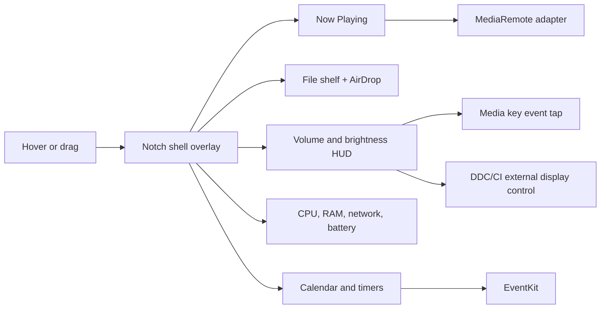
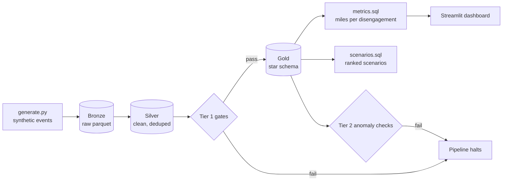
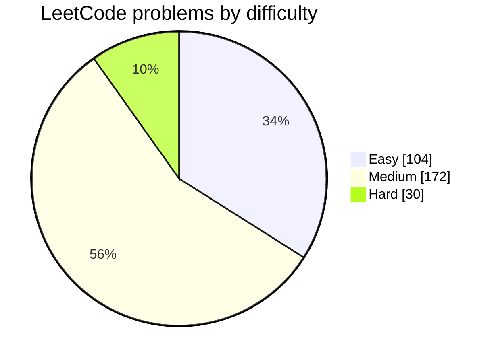
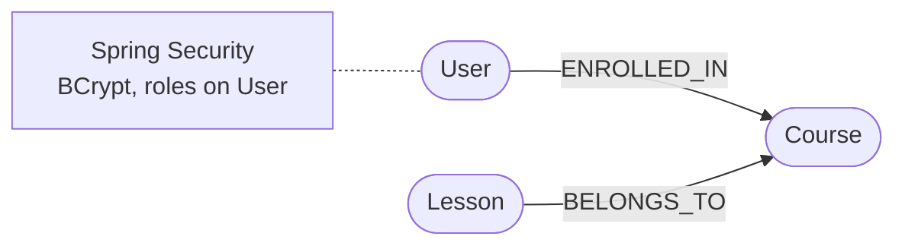
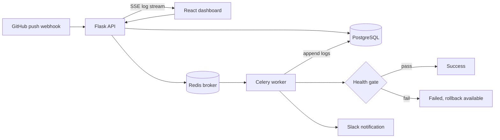

# Shivam Parashar

I build backend services and the infrastructure that keeps them honest: APIs, data pipelines, deployment tooling, and the checks that catch failures before users do.

Seattle, WA · Open to relocate · Backend, infrastructure, platform, SRE, and AI infra roles

[LinkedIn](https://linkedin.com/in/shivam-parashar1) · [sp3466@rit.edu](mailto:sp3466@rit.edu) · [Resume (PDF)](https://spador.github.io/Shivam/assets/Shivam_Resume.pdf)

## Projects

### [LLM Model Eval](https://github.com/Spador/llm-model-eval) · Text-to-SQL Model Selection

Picking the best LLM for a natural language cricket stats feature under a $5,000
monthly budget. Turns the constraints into a hard price ceiling, filters a
leaderboard down to 6 candidates, then runs a custom eval on 20 hard text-to-SQL
questions against a real IPL database. The leaderboard ranking did not survive
the eval: the winner was ranked 14th.

`Python` `OpenRouter` `SQLite` `pandas`

**[Repo](https://github.com/Spador/llm-model-eval)** ·
**[Full approach](https://github.com/Spador/llm-model-eval/blob/main/APPROACH.md)** ·
**[Results](https://github.com/Spador/llm-model-eval/blob/main/results/eval_results.csv)**

### [Halo](https://github.com/Spador/Halo)

A free, open source Dynamic Island for the MacBook notch. Hover and it expands into media controls, a file shelf, custom volume and brightness HUDs, system stats, a calendar, and timers.

`Swift 6` · `SwiftUI` · `AppKit` · `Homebrew cask`

- Replaces the system volume and brightness HUDs by intercepting media key events with a CGEvent tap, filtered so ordinary keystrokes never reach the app.
- Controls external monitor speaker volume over DDC/CI through IOAVService, a channel macOS itself does not expose.
- Reads system wide Now Playing data through a vendored MediaRemote adapter after Apple locked the direct API in macOS 15.4. Every private surface fails gracefully.

### [Engineering-playbook](https://github.com/Spador/Engineering-playbook)

<table>
<tr>
<td width="45%" valign="top">

</td>
<td width="55%" valign="top">

A senior engineer in a box: fundamentals with copy-ready templates and honest tradeoff tables, twelve worked system design case studies, and a design advisor. [Live site](https://spador.github.io/Engineering-playbook/).

`Next.js` · `MDX` · `Tailwind` · `Mermaid` · `Fuse.js` · `GitHub Actions`

- CI enforces the content schema: an entry missing a diagram, a template, or a tradeoff table fails validation and cannot merge.
- Fully static export, no server, no database. The command palette fuzzy searches every topic, heading, and glossary term against a prebuilt index.
- Twelve case studies from URL shortener to Uber, each linking back to the fundamentals it uses.

</td>
</tr>
</table>

### [FleetSignal](https://github.com/Spador/FleetSignal)

A fleet telemetry pipeline: synthetic self-driving events flow through a bronze, silver, gold warehouse into a safety metric and mined scenarios, guarded by quality gates and anomaly detection. One command runs all of it.

`Python` · `DuckDB` · `Parquet` · `SQL` · `Streamlit` · `GitHub Actions`

- Two tier failure detection: deterministic gates on schema, nulls, ranges, and referential integrity sit between silver and gold; statistical checks track volume, freshness, drift, and vehicle dropout against a rolling baseline.
- The generator injects four fault types on demand and each one is caught by a specific check, so the detection is provable, not decorative.
- The DuckDB transform layer stays under two seconds at five million events. The whole warehouse is parquet files, no server to host.

### [cloudpulse](https://github.com/Spador/cloudpulse)

<table>
<tr>
<td width="45%" valign="top">

</td>
<td width="55%" valign="top">

Self hosted AWS cost and resource monitoring: daily and monthly cost breakdowns, resource inventory, and anomaly detection, with no SaaS fees.

`Python` · `Flask` · `boto3` · `React` · `Terraform` · `DynamoDB` · `Lambda`

- Surfaces cost spikes above 20 percent day over day and ranks them by severity instead of alerting on raw thresholds.
- Mock mode runs the full stack with zero AWS credentials, so anyone can demo it without an account.
- Terraform provisions the hourly polling Lambda, DynamoDB storage, IAM roles, and the CloudWatch schedule.

</td>
</tr>
</table>

### [Leetcode-streak](https://github.com/Spador/Leetcode-streak)

306 LeetCode problems solved in Python, one folder per problem with the statement, the approach, and the solution.

`Python`

- Every problem gets its own write-up: statement, approach, then implementation, so the repo doubles as a review reference.
- Organized by difficulty with consistent structure, so any solution is one path lookup away.

### [InfraGraph](https://github.com/Spador/InfraGraph)

<table>
<tr>
<td width="45%" valign="top">

</td>
<td width="55%" valign="top">

Upload Terraform and Kubernetes files and get a live, interactive dependency graph: parsed to nodes and edges, stored in Neo4j, rendered force directed in D3.

`Python` · `Flask` · `Neo4j` · `React` · `D3.js` · `Docker Compose`

- Terraform edges are inferred by recursively walking every attribute string for interpolation references, plus explicit depends_on entries.
- Graph loads are idempotent Cypher MERGEs, so re-uploading files updates the graph instead of duplicating it.
- Nodes are sized by connectivity and colored by resource type. Click to inspect properties, toggle types on and off.

</td>
</tr>
</table>

### [RateShield](https://github.com/Spador/RateShield)

<table>
<tr>
<td width="45%" valign="top">

</td>
<td width="55%" valign="top">

API rate limiter middleware backed by Redis, implementing three canonical algorithms with an admin dashboard, live metrics, and a reverse proxy mode.

`Python` · `Flask` · `Redis` · `Lua` · `Next.js` · `Locust` · `Docker Compose`

- The token bucket runs as a Redis Lua script via EVAL, so refill and consume happen atomically in a single round trip with no race between clients.
- The algorithms trade differently: sliding window log is exact but pays O(requests) memory per window, fixed window is O(1) but bursts at boundaries. The dashboard makes the tradeoffs visible under load.
- Proxy mode enforces limits in front of any upstream service. A Locust harness load tests the middleware itself.

</td>
</tr>
</table>

### [Neo4J-Curriculum-Management](https://github.com/Spador/Neo4J-Curriculum-Management)

Spring Boot and Neo4j backend for a course enrollment system: authentication, role based access, and a graph model of users, courses, and lessons. Pairs with [Curriculum-Management-Frontend](https://github.com/Spador/Curriculum-Management-Frontend).

`Java 21` · `Spring Boot` · `Spring Security` · `Neo4j` · `Cypher` · `Maven`

- Authentication is backed by the graph itself: a custom UserDetailsService loads users and roles from Neo4j, with BCrypt hashed passwords.
- Enrollment is a relationship, not a join table: `(User)-[:ENROLLED_IN]->(Course)`, lessons attached via `(Lesson)-[:BELONGS_TO]->(Course)`, so every query is a traversal.

### [Curriculum-Management-Frontend](https://github.com/Spador/Curriculum-Management-Frontend)

<table>
<tr>
<td width="45%" valign="top">

</td>
<td width="55%" valign="top">

React SPA for the curriculum system: browse courses, enroll, and watch lessons. Pairs with the [Spring Boot and Neo4j backend](https://github.com/Spador/Neo4J-Curriculum-Management).

`React 18` · `React Router v6` · `Bootstrap 5` · `Axios` · `Context API`

- Protected routes with a RequiredAuth wrapper over React Router and a Context based auth provider.
- A private Axios instance hook attaches credentials to authenticated calls in one place.
- Lessons play in an embedded YouTube player mapped from the course data.

</td>
</tr>
</table>

### [DeployDeck](https://github.com/Spador/DeployDeck)

Self hosted continuous deployment dashboard: tracks deployments, streams live logs, enforces post deploy health gates, and rolls back with one click. Runs entirely locally on Docker Compose.

`Python` · `Flask` · `Celery` · `Redis` · `PostgreSQL` · `React` · `TypeScript` · `Docker Compose`

- Deploy logs stream to the browser over server sent events while the Celery worker appends them, no polling.
- Post deploy health gates hit the application endpoint and automatically fail the deployment on a wrong status code.
- A GitHub push webhook triggers the full chain: trigger, deploy, gate, notify. Any deployment rolls back to the last successful version in one click.

## Experience

### [Saayam For All](https://saayamforall.org) — Backend Engineer

- Built stateless REST APIs in Flask with request validation, isolated business logic, and production ready error handling.
- Implemented a deterministic, score based matching service, with LLM classification as an enrichment step rather than the decision maker.
- Deployed on AWS Lambda and API Gateway, tuned for concurrency, latency, and cost, with least privilege IAM across services.

### [Deloitte Consulting USI](https://www.deloitte.com/us/en.html) — Software Engineer

- Provisioned and governed infrastructure as code on AWS with Terraform for EC2, S3, and VPC configurations.
- Streamlined CI/CD pipelines for Java applications using Jenkins, Maven, and Gradle, cutting deployment times by 30 percent.
- Automated sandbox environment provisioning with Terraform and Docker on Kubernetes clusters, cutting setup time by 40 percent.

### [Oracle](https://www.oracle.com) — Software Engineer (Backend), Co-op

- Built Java REST APIs on Oracle WebLogic, improving service integration and reducing production errors.
- Optimized SQL and PL/SQL with indexes and views, cutting report generation time by 19 percent.
- Automated database maintenance with shell scripting, reducing manual operational effort by 30 percent.

## Skills

| Area | Tools |
|---|---|
| Languages | Python, Java, SQL, C/C++, Shell/Bash |
| Databases | PostgreSQL, Neo4j (Cypher), DynamoDB, MongoDB |
| Cloud and infrastructure | AWS (IAM, EC2, S3, Lambda, Route 53, ELB, CloudFront), OCI, Terraform, Docker, Kubernetes |
| CI/CD and DevOps | GitHub Actions, Jenkins, GitLab CI, Git, Jira, MCP |
| AI infrastructure | AWS Bedrock, SageMaker, LangGraph, CrewAI |
| Backend | REST APIs (Flask, Spring Boot), JSON |

## Certifications

<table>
<tr>
<td align="center" width="50%">

**AWS Certified Solutions Architect – Associate (SAA-C03)**

Issued Aug 2025 · Expires Aug 2028 · [Verify](https://www.credly.com/badges/b2c32831-a4dc-45ab-b9ed-5dca0969ccb8/public_url)

</td>
<td align="center" width="50%">

**AWS Certified Cloud Practitioner (CLF-C02)**

Issued Jul 2025 · Expires Jul 2028 · [Verify](https://www.credly.com/badges/f4a440de-4a0d-499a-9278-cfc97bc44dd9/public_url)

</td>
</tr>
</table>

## Education

**[Rochester Institute of Technology](https://www.rit.edu)** — MS, Computer Science. GPA 3.8. Project work in graph backed services and DevOps automation.

**[Vellore Institute of Technology](https://vit.ac.in)** — BS, Computer Science.

---

Building infrastructure or AI tooling and need a backend engineer? Reach me at [sp3466@rit.edu](mailto:sp3466@rit.edu) or on [LinkedIn](https://linkedin.com/in/shivam-parashar1).
